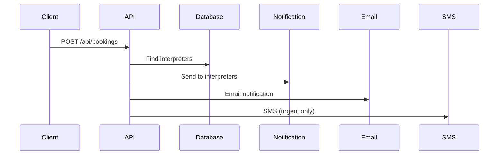
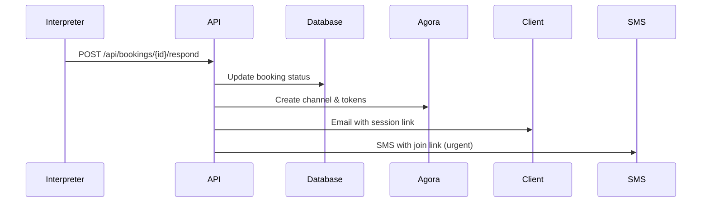

# Communication System Setup Guide

This guide covers setting up the complete interpreter-client communication system for LanguageHelp.

## Required Third-Party Services

### 1. Database (Supabase)
```bash
# Environment Variables
NEXT_PUBLIC_SUPABASE_URL=your_supabase_url
SUPABASE_SERVICE_ROLE_KEY=your_service_role_key
```

**Setup Steps:**
1. Create a Supabase project
2. Run the SQL from `docs/database-schema.md`
3. Enable Row Level Security (RLS)
4. Set up authentication

### 2. Video Communication (Agora.io)
```bash
# Environment Variables
AGORA_APP_ID=your_agora_app_id
AGORA_APP_CERTIFICATE=your_agora_certificate
AGORA_CUSTOMER_ID=your_customer_id
AGORA_CUSTOMER_SECRET=your_customer_secret
```

**Setup Steps:**
1. Sign up at [Agora.io](https://www.agora.io/)
2. Create a project and get App ID & Certificate
3. Enable Cloud Recording (optional)
4. Install SDK: `npm install agora-rtc-sdk-ng agora-access-token`

**Alternative Options:**
- **Twilio Video**: `npm install twilio-video`
- **Daily.co**: `npm install @daily-co/daily-js`
- **Whereby Embedded**: Iframe-based integration

### 3. Phone Communication (Twilio)
```bash
# Environment Variables
TWILIO_SID=your_twilio_sid
TWILIO_AUTH_TOKEN=your_twilio_auth_token
TWILIO_PHONE_NUMBER=your_twilio_phone
```

**Setup Steps:**
1. Sign up at [Twilio](https://www.twilio.com/)
2. Buy a phone number
3. Set up TwiML applications
4. Install SDK: `npm install twilio`

### 4. Email Notifications (Resend)
```bash
# Environment Variables
RESEND_API_KEY=your_resend_api_key
```

**Setup Steps:**
1. Sign up at [Resend](https://resend.com/)
2. Verify your sending domain
3. Get API key
4. Install SDK: `npm install resend`

**Alternative Options:**
- **SendGrid**: `npm install @sendgrid/mail`
- **AWS SES**: `npm install @aws-sdk/client-ses`

### 5. Cloud Storage (AWS S3 - for recordings)
```bash
# Environment Variables
AWS_ACCESS_KEY_ID=your_access_key
AWS_SECRET_ACCESS_KEY=your_secret_key
AWS_REGION=us-east-1
AWS_S3_BUCKET=your-recordings-bucket
```

**Setup Steps:**
1. Create AWS account
2. Create S3 bucket for recordings
3. Set up IAM user with S3 permissions
4. Configure CORS for bucket access

## Implementation Flow

### 1. Client Requests Interpreter


### 2. Interpreter Responds


### 3. Video Session
```mermaid
sequenceDiagram
    Client->>Agora: Join channel
    Interpreter->>Agora: Join channel
    Agora->>Both: Establish connection
    Both->>Agora: Audio/Video streams
    Optional: Agora->>S3: Record session
```

## Package Installation

```bash
# Core communication packages
npm install agora-rtc-sdk-ng agora-access-token
npm install twilio
npm install resend

# UI packages for video session
npm install lucide-react @radix-ui/react-badge

# Real-time features (optional)
npm install pusher-js # or socket.io-client
```

## Configuration Steps

### 1. Environment Variables
Create `.env.local`:
```bash
# Database
NEXT_PUBLIC_SUPABASE_URL=https://your-project.supabase.co
SUPABASE_SERVICE_ROLE_KEY=your_service_role_key

# Video (Agora)
AGORA_APP_ID=your_app_id
AGORA_APP_CERTIFICATE=your_certificate

# Phone (Twilio)
TWILIO_SID=AC...
TWILIO_AUTH_TOKEN=your_token
TWILIO_PHONE_NUMBER=+1234567890

# Email (Resend)
RESEND_API_KEY=re_...

# App URL
NEXT_PUBLIC_APP_URL=http://localhost:3000
```

### 2. Database Tables
Run the SQL from `docs/database-schema.md` in your Supabase SQL editor.

### 3. API Routes
The following API routes handle the communication flow:
- `POST /api/bookings` - Create booking request
- `GET /api/bookings` - Get user's bookings
- `POST /api/bookings/[id]/respond` - Accept/decline booking
- `GET /api/sessions/[id]/token` - Get video session token

### 4. Real-time Updates (Optional)
For real-time notifications, add:

```bash
# Using Pusher
npm install pusher pusher-js
```

Create pusher service:
```typescript
// src/lib/pusher.ts
import Pusher from 'pusher';

export const pusher = new Pusher({
  appId: process.env.PUSHER_APP_ID!,
  key: process.env.PUSHER_KEY!,
  secret: process.env.PUSHER_SECRET!,
  cluster: process.env.PUSHER_CLUSTER!,
});
```

## Cost Considerations

### Agora.io Pricing
- **Audio**: $0.99 per 1,000 minutes
- **Video**: $3.99 per 1,000 minutes
- **Recording**: $1.49 per 1,000 minutes

### Twilio Pricing
- **Voice calls**: $0.0130 per minute (US)
- **SMS**: $0.0075 per message (US)
- **Phone numbers**: $1.00 per month

### Alternative Free/Cheaper Options
- **WebRTC Direct**: Free peer-to-peer (no recording)
- **Jitsi Meet**: Open source video conferencing
- **Socket.io**: Real-time signaling only

## Security Considerations

### 1. Token Generation
- Generate Agora tokens server-side only
- Set appropriate expiration times
- Use unique UIDs for each session

### 2. Access Control
- Verify user permissions before generating tokens
- Implement session timeouts
- Log all session activities

### 3. Data Privacy
- Encrypt recordings at rest
- Implement data retention policies
- GDPR/CCPA compliance for recordings

## Testing

### 1. Local Development
```bash
# Start development server
npm run dev

# Test video session (open two browser windows)
# Window 1: /session/test?role=client
# Window 2: /session/test?role=interpreter
```

### 2. Production Testing
- Test with real phone numbers
- Verify email deliverability
- Test video quality on different devices
- Load test with multiple concurrent sessions

## Monitoring

### 1. Agora Console
- Monitor call quality metrics
- Track usage and costs
- View error logs

### 2. Application Monitoring
```typescript
// Track session metrics
const trackSessionEvent = (event: string, data: any) => {
  // Send to your analytics service
  analytics.track('session_event', {
    event,
    ...data,
    timestamp: new Date().toISOString()
  });
};
```

## Deployment

### 1. Environment Variables
Set all required environment variables in your deployment platform:
- Vercel: Project Settings → Environment Variables
- Netlify: Site Settings → Environment Variables
- Railway/Heroku: Config vars

### 2. Domain Configuration
- Update CORS settings in Agora console
- Configure Twilio webhooks
- Set up proper SSL certificates

### 3. Scaling Considerations
- Use Redis for session state management
- Implement horizontal scaling for API routes
- Consider CDN for static assets
- Monitor database connection pools
